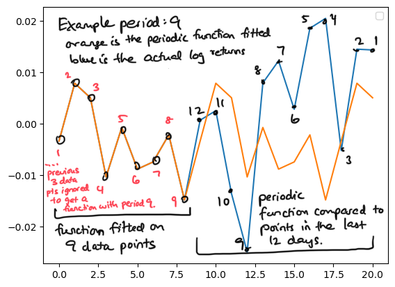
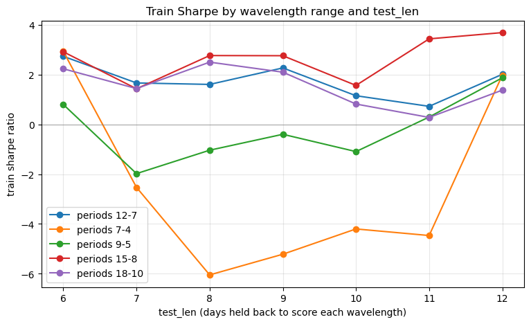
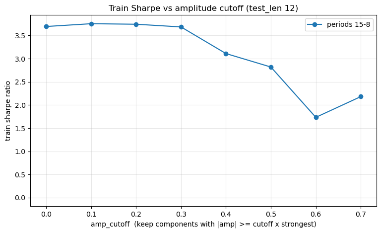

# Abstract

For this project, I chose the option of making my own trading algorithm. The algorithm in my project relies on extracting patterns of repetition in stock market data. The price of an asset can fluctuate around the fair price for the following reason: when buyers realize the actual price is overvalued compared to its fair, they stop buying and start selling, driving down the price; inversely, when buyers realize the actual price is undervalued compared to its fair, they stop selling and start buying, driving up the price. This behavior would translate into a harmonic motion of sorts around the fair price, so the algorithm can take advantage of this pattern.

# Methods

## Algorithm

The dataset used for this project is the stock_data.parquet file provided for Lab 02. The algorithm is as follows:

Let’s say we have 24 days of data on a single asset's log return behind us. 
1. Using the log returns from the last 24 days, we can try to extract the effective frequency that the log returns of the asset fluctuates at. To do this, we fit data points from 24 days ago until to 12 days ago with multiple periodic functions, one with period 7, one with period 8, …, and one with a period of 12 days. 
2. For each of these functions:
    1. We can decide to filter out frequencies that aren't as strong as others.
    2. We need to measure how effectively it can predict the log returns within the last 12 days. To do this, the function is extended to cover the last 12 days, and the MSE metric is used to measure how closely the periodic function can predict the last 12 days.
3. We select the periodic function with the least MSE. Note that the frequency of this function is the effective frequency of oscillation within the data locally (in the last 12 days).
4. With the chosen periodic function, we can then try to predict the forward log return (the log return of the next day) by extending the periodic function into the next day. The position we have for the current day will be proportional to this predicted forward log return.

See the image below for an example of what goes on in Steps 2.1 and 2.2.

The algorithm receives three inputs: the range of periods to test (which is 7-12 in the example above), the length of the testing window (which is 12 in the example above), and a frequency transform (that can attentuate/amplify certain frequencies in the signal).

The training set has ticker data for 41 days, and the test set has ticker data for 42 days.

## Experiments

To select the optimal choice of (period range, testing window length, frequency transform), the data in stock_data.parquet are split into a training set and test set by date. The algorithm is run on the training set for various pairs of (period range, testing window length, frequency transform), and we find the pair with the greatest Sharpe ratio. Then, we evaluate the Sharpe ratio of the algorithm with the optimal (period range, testing window length, frequency transform) combination on the test set.

# Results

As a baseline, the equal weight strategy achieves a Sharpe ratio of 3.66 and a cumulative log return of 0.0695 on the training set, and 4.01 and 0.0681 respectively on the test set.

Here's a graph of the Sharpe ratios, for every (period range, testing window length) combination where `period range` is among {7-to-4, 9-to-5, 12-to-7, 15-to-8, 18-to-10} and `testing window length` is among {6, 7, 8, 9, 10, 11, 12}.

Performance is hurt the most when `period range` is smallest (that is, when `period_range` is 7-to-4 or 9-to-5) for many choices of `testing window length`. On the other hand, we see a Sharpe ratio consistently above 0 for the other `period range` choices. The combination that gives us best performance is `testing window length`=12 and `period range`="15-to-8", with a Sharpe ratio of 3.69 and cumulative log return of 0.0281. 

For all of these combinations, no frequency filtering is performed. In this setting, the testing window points are evaluated against a periodic extension of the raw prior points.

Using the optimal settings, running the algorithm on the test set achieves a Sharpe ratio of 3.77 and cumulative log return of 0.0273. 

With regard to evaluating different frequency transforms, we use an amplitude cutoff value ⍺ between 0 and 1, which removes frequencies f such that $A_f / \max_{\text{all f}}(A_f)$ < ⍺. We test ⍺ in the range [0, 0.7].

For the optimal setting of `period range` and `testing window length`, frequency filtering tends to hurt the resulting Sharpe ratio as more frequencies are filtered out.

Caveat: Some Sharpe ratios are very high (3+). Hopefully using a larger dataset that contains more than 83 days and that doesn't reflect a mostly-bull market would help with calculating a more accurate Sharpe ratio.

**Please see my code in the section **My Strategy** in `final_project.ipynb`**.
