# Results

In each of the cells below is an image of the returns of the strategy along with a description of the conditions used.

1. In the Fourier analysis in Step 2.1, no frequencies were filtered out. This is virtually the same as using the raw log return data points from before 12 days ago and measuring their ability to predict the data points within the last 12 days.

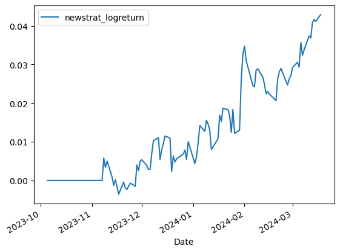

2. In the Fourier analysis in Step 2.1, frequencies that had an amplitude \<25% than the frequency with the maximum amplitude were filtered out.

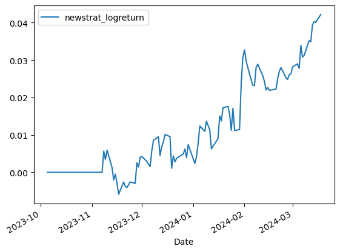

3. In the Fourier analysis in Step 2.1, frequencies that had an amplitude \<50% than the frequency with the maximum amplitude were filtered out.

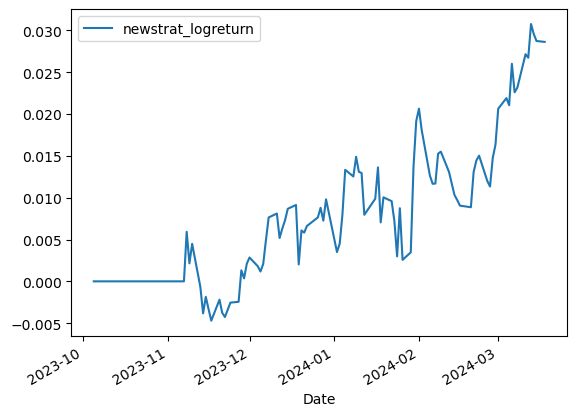

4. In the Fourier analysis in Step 2.1, frequencies that had an amplitude \<75% than the frequency with the maximum amplitude were filtered out.

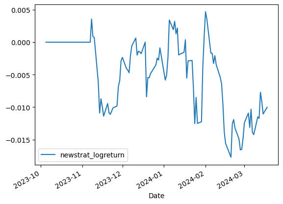

We see that the returns get progressively worse as we filter out more and more frequencies from each selected function in Step 2.1.

I also experimented with Step 1, by trying different ranges of periods for the different periodic functions to test. I initially tried different periodic functions, with periods ranging from 7 days to 12 days. In the following trials, I also tried period ranges of 4 to 7, 5 to 9, 8 to 15, 10 to 18, 11 to 21, 13 to 24, 14 to 27, and 16 to 30. For each of the following trials, no filtering was performed in Step 2.1, as that yielded the best results for the original experiment. 
Note: Each period range is of the form `n` to `2n-1` or `n` to `2n-2` because there is no use in testing periods below `n`. For example, a function that has period `n-1` also has a period of `2n-2`, which is already included in the period range. Similarly, all functions with smaller periods would have been taken care of by fitting functions with periods in the interval `n` to `2n-1` or `2n-2`.

Fitting functions with period of 4 days to 7 days:

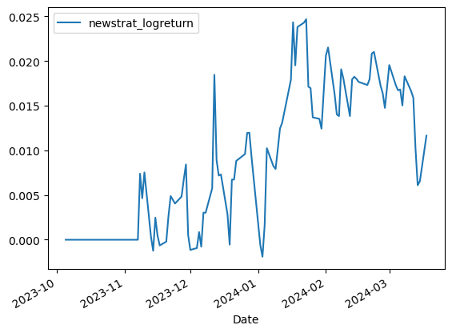

Fitting functions with period of 5 days to 9 days:

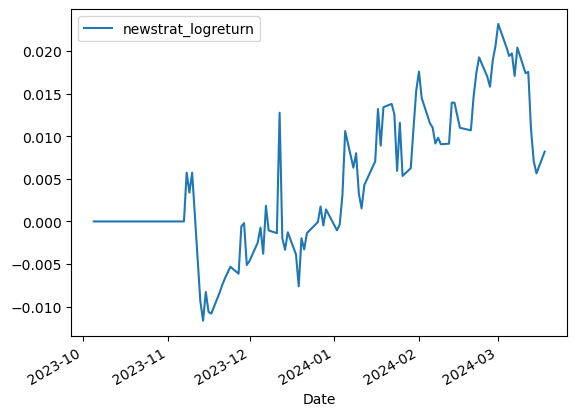

Fitting functions with period of 8 days to 15 days:

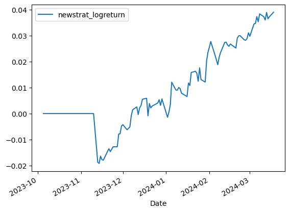

Fitting functions with period of 10 days to 18 days:

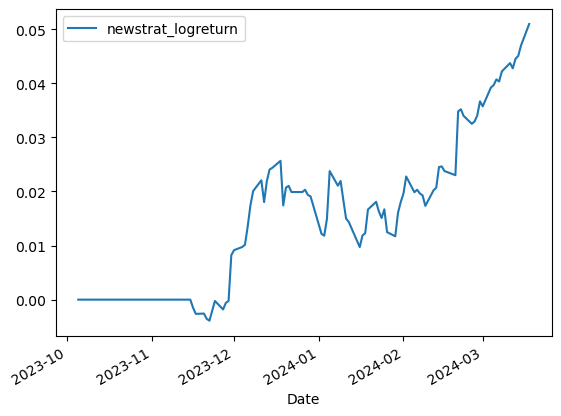

Fitting functions with period of 11 days to 21 days:

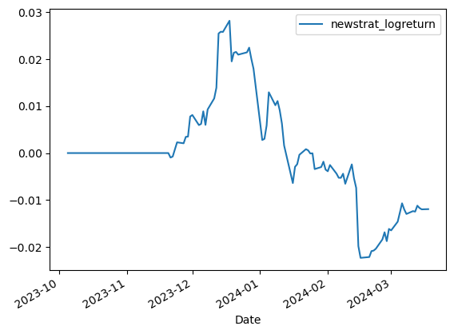

Fitting functions with period of 13 days to 24 days:

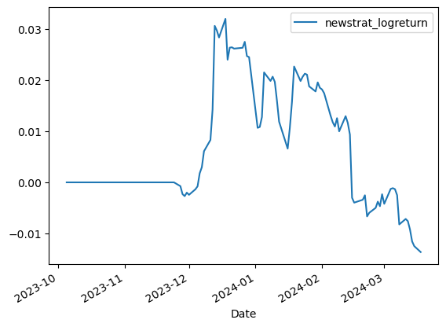

Fitting functions with period of 14 days to 27 days:

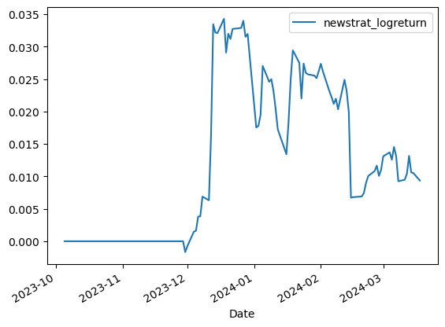

Fitting functions with period of 16 days to 30 days:

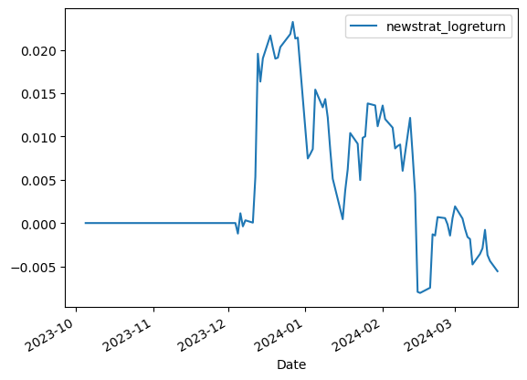

When compared with the original algorithm, log returns for these approaches seem to mostly perform worse and fluctuate wildly. However, using a period range of 8 to 15 gets us an ending log return close to 0.04, and and using a period range of 10 to 18 gets us an ending log return of around 0.05, which is better than for our original period range of 6 to 12. This tells us that taking into account much longer periods, like 18 days or larger, and excluding periods in the range from 6 to 18 causes the algorithm to perform worse and have less predictive power.

# Conclusion

In comparison to the momentum based trading strategy shown in Lab 02, this algorithm has a similar ending log return of around 0.04, and the returns seem to fluctuate less for this algorithm.

However, this algorithm doesn't perform nearly as well as the equal position strategy. The image below compares all three strategies, where my strategy is drawn in green.

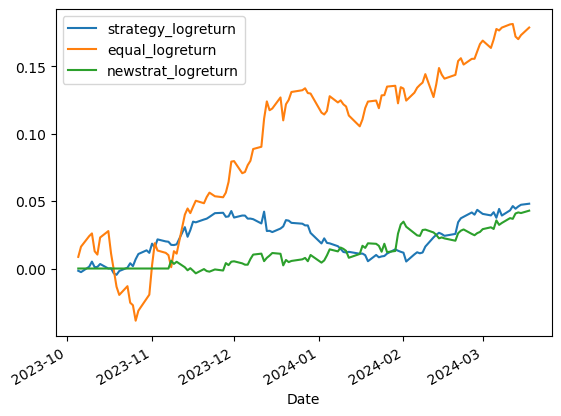